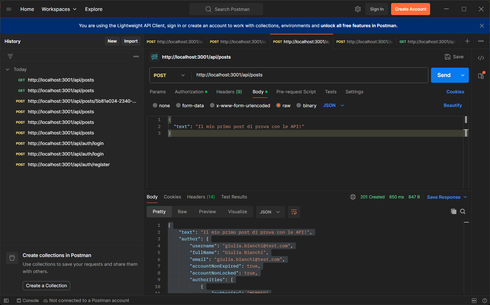
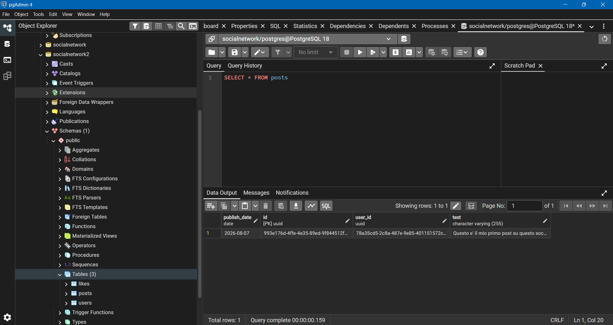
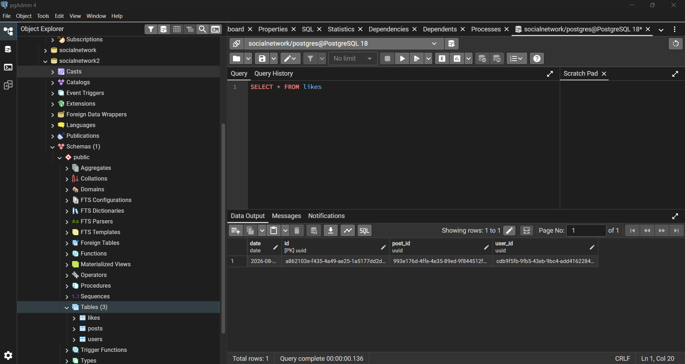

# Progetto Settimana 17 - REST API con Spring Boot

Progetto backend sviluppato con **Spring Boot**, **Spring Security (JWT)**, **Spring Data JPA** e database relazionale per la gestione di utenti, post e un sistema di "mi piace" (likes).

---

## 🔒 Regole di Autorizzazione

* **Autenticazione JWT (JSON Web Token):** 
  * *Applicata a:* Creazione/Modifica post, aggiunta e rimozione like.
  * *Perché:* Garantisce che solo gli utenti registrati e in possesso di un token valido possano interagire con le risorse, associando automaticamente l'azione all'utente autenticato.
* **Controllo basato sui Ruoli (@PreAuthorize):** 
  * *Applicata a:* Modifica del ruolo utente (`PATCH /api/users/{userId}/role`).
  * *Perché:* Questa operazione critica è protetta tramite l'annotazione di sicurezza per consentire l'accesso unicamente agli utenti con il ruolo di `MODERATOR`, impedendo modifiche non autorizzate.

---

## 📂 Endpoints Principali

### 1. Auth
* `POST /api/auth/register` - Registrazione di un nuovo utente
* `POST /api/auth/login` - Login e generazione del token JWT

### 2. Users
* `PATCH /api/users/{userId}/role` - Modifica del ruolo utente (richiede ruolo `MODERATOR`)

### 3. Posts
* `GET /api/posts` - Lettura di tutti i post
* `GET /api/posts/{postId}` - Lettura di un singolo post per ID
* `POST /api/posts` - Creazione di un nuovo post (protetto da JWT)
* `PUT /api/posts/{postId}` - Aggiornamento di un post esistente (protetto da JWT)

### 4. Likes
* `POST /api/posts/{postId}/likes` - Aggiunta di un like (con controllo anti-doppione)
* `DELETE /api/posts/{postId}/likes` - Rimozione di un like esistente

---

## 🧪 Collezione Postman
La collezione completa con tutte le richieste testate è inclusa nel repository all'interno della cartella di progetto.

---

## 📸 Test e Database

### 1. Test su Postman
> 

### 2. Dati nel Database (Tabella Posts)
> 

### 3. Dati nel Database (Tabella Likes)
> 
